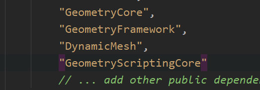

### UE DynamicMesh 相关API

### 编辑器下


### 自定义扩展
##### 模块build.cs 添加 DynamicMesh 相关模块名


### 核心
#### UDynamicMesh
可以看作存有一组几何体相关数据结果（顶点，三角面）的UObject，通过修改这些几何数据去得到想要的几何体。整体类似于StaticMesh，但UDynamicMesh并非序列化后的资产，是动态存在内存中的对象；也可以将UDynamicMesh转换为序列化后的资产（StaicMesh）
#### UDynamicMeshComponent
整体同样类似于UStaticMeshComponet，不过是对UDynamicMesh进行操控，绘制。
#### UDynamicMeshPool
因为UDynamicMesh并非序列化的资产，不像StaticMesh已经序列化好可以被多个对象同时引用，UDynamicMesh往往是动态生成的，因此需要一个对象池来管理一些临时动态的UDynamicMesh。UDynamicMeshPool已经封装好了一些分配，释放UDynamicMesh的函数。
#### ...
### GeometryScript库
一组继承于UBlueprintFunctionLibrary的函数库，包含操作DynamicMesh相关的绝大部分功能。
相关文档：
https://docs.unrealengine.com/5.3/zh-CN/geometry-scripting-reference-in-unreal-engine/

### 常用工具函数
```c
//来自于GeometryScript库

//用静态网格体资产去构建UDynmicMesh
UGeometryScriptLibrary_StaticMeshFunctions::CopyMeshToStaticMesh()
//用UDynmicMesh去更新一个静态网格体资产
UGeometryScriptLibrary_StaticMeshFunctions::CopyMeshFromStaticMesh()
//附加一个Box/Sphere/Cylinder...到UDynmicMesh
UGeometryScriptLibrary_MeshPrimitiveFunctions::AppendBox()
//按网格体连接情况分割UDynmicMesh，新增的UDynmicMesh从动态网格体池分配
UGeometryScriptLibrary_MeshDecompositionFunctions::SplitMeshByComponents()
//为UDynmicMesh生成简单碰撞形状，用于物理查询
UGeometryScriptLibrary_CollisionFunctions::SetDynamicMeshCollisionFromMesh()
//对UDynmicMesh进行布尔运算，即建模中的挤出合并等操作
UGeometryScriptLibrary_MeshBooleanFunctions::ApplyMeshBoolean()
```
